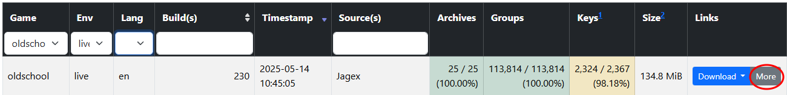
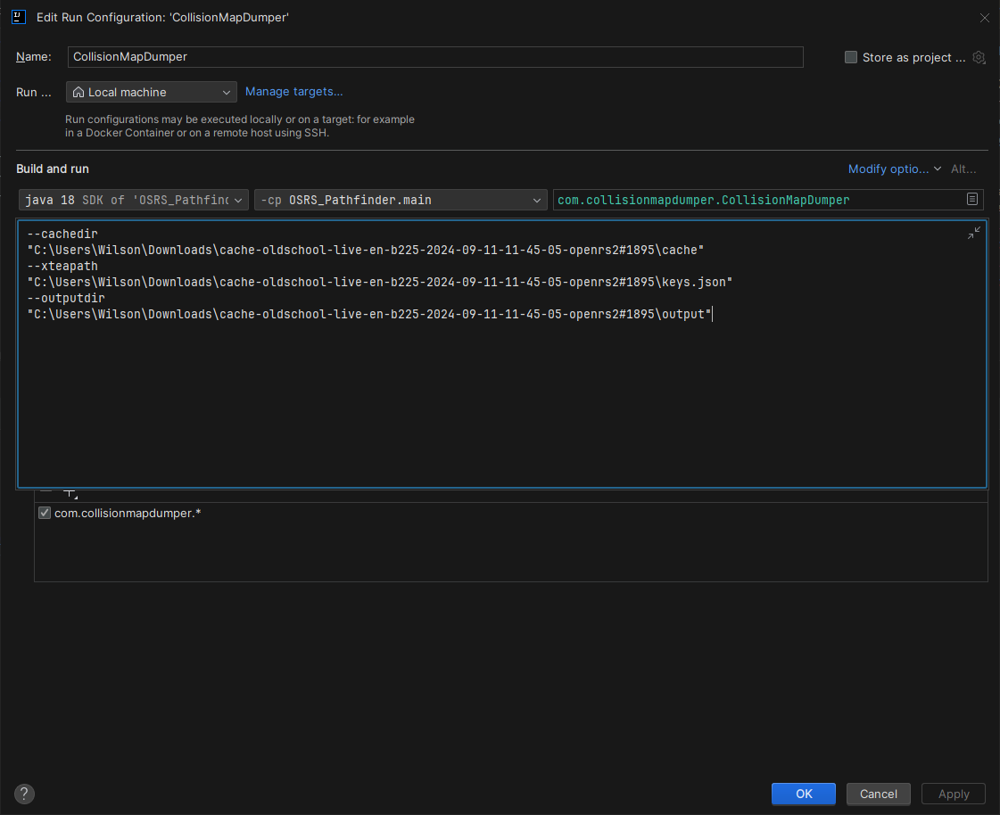

## Build and Deploy Instructions

Follow these steps to build and deploy the application using AWS SAM:

### 1. Build the Fat JAR

Use Gradle with the Shadow plugin to build the executable fat JAR:

```bash
./gradlew shadowJar
```

### 2. Deploy to AWS Lambda

```bash
./gradlew deployPathfinder
```

### 3. Test and Save Results to build/reports/tests/index.html

```bash
./gradlew testPathfinder
```

[//]: # (### 3. Invoke Lambda)

[//]: # (```bash)

[//]: # (aws lambda invoke --function-name Pathfinder --cli-binary-format raw-in-base64-out --payload '{\"sourceX\": 100, \"sourceY\": 200, \"sourceZ\": 300}' response.json --profile user2)

[//]: # (```)

## Collision Map Generation

If your collision map is out of date, you can regenerate collision-map.zip using the following steps:

### 1. Select Gamepack

From [OpenRS2 Archive](https://archive.openrs2.org/caches), select:

- **Game:** oldschool
- **Env:** live

Once you've found a game cache that you're happy with, click the 'More' button as shown below:


### 2. Download Cache (.dat2/idx) + Keys (JSON)

Download both Cache (.dat2/idx) and Keys (JSON), storing them in an easily accessible location

### 3. Configure Directories and Paths

1. Extract the downloaded zip file, and use the path to the cache folder as the cachedir
    - e.g., `--cachedir "C:\Users\Wilson\Downloads\cache-oldschool-live-en-b230-2025-05-14-10-45-05-openrs2#2186\cache"`
2. Set xteapath to the downloaded json file
    - e.g., `--xteapath "C:\Users\Wilson\Downloads\keys-oldschool-live-en-b230-2025-05-14-10-45-05-openrs2#2186.json"`
3. Set outputdir to the desired output directory (you could export to an external location or straight to resources)
    - e.g.,
      `--outputdir "C:\Users\Wilson\Downloads\cache-oldschool-live-en-b230-2025-05-14-10-45-05-openrs2#2186\output"`

This process should result in something that looks like the following:


### 4. Execute CollisionMapDumper

Run CollisionMapDumper with command line arguments which were set up in the previous step

